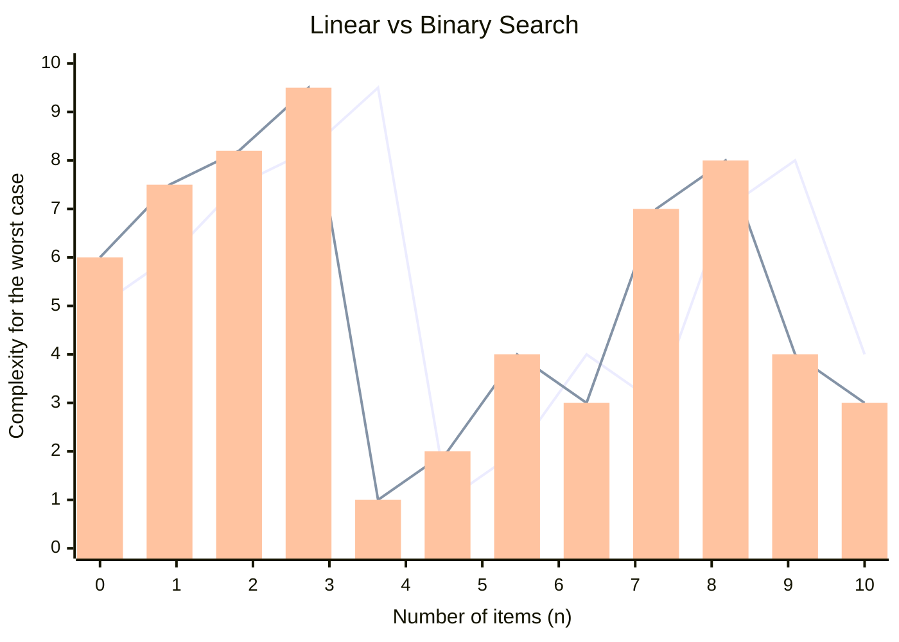

# Introduction

These abstract data structures are language-agnostic. They are purely conceptual and can be implemented in any programming language.

# Complexity Analysis

#### Big_Oh Notation

- Constant time – $O(1)$
- Logarithmic time – $O(logn)$
- Linear time: – $O(n)$
- Quadratic time – $O(n^2)$

$O(1) < O(logn) < O(n) < O(nlogn) < O(n^2)$

![[Pasted image 20240609225249.png]]

Ignore the coefficients and find the term that grows the fastest!

# Linear / Binary Search

Complexities for linear and binary search.

![[Pasted image 20240609225451.png]]

# Sorting Algorithms

### Bubble Sort

Bubble sort performs a number of passes through the array. In each pass:

- Scan the array from left to right;
- Compare each pair of adjacent elements; and
- Swap them if they are out of order.

![[Pasted image 20240609230105.png]]

Example sort:

| Step    | Array           |
| ------- | --------------- |
| To sort | `5, 2, 4, 3, 1` |
| Step 1  | `2, 4, 3, 1, 5` |
| Step 2  | `2, 3, 1, 4, 5` |
| Step 3  | `2, 1, 3, 4, 5` |
| Step 4  | `1, 2, 3, 4, 5` |

### Selection Sort

Selection sort performs a number passes through the array. In the i-th pass:

- Scan the array from left to right until the i-th last element;
- Find the i-th largest element in the array; and
- Swap the i-th largest element and the i-th last element.

Example sort:

| Step    | Array           |
| ------- | --------------- |
| To sort | `5, 2, 4, 3, 1` |
| Step 1  | `1, 2, 4, 3, 5` |
| Step 2  | `1, 2, 3, 4, 5` |

### Insertion Sort

To begin with, a player picks up the 1st card, and holds it in their hand (no sorting is needed);

Then the player picks up the *ith* card and puts it in the position so that the *i* cards are sorted (probably ascendingly);

The player repeats this action until they have enough cards in their hand to play.

![[Pasted image 20240609233014.png]]

Example Sort:

| Step    | Array           |
| ------- | --------------- |
| To sort | `5, 2, 4, 3, 1` |
| Pass 1  | `5, 2, 4, 3, 1` |
| Pass 2  | `2, 5, 4, 3, 1` |
| Pass 3  | `2, 4, 5, 3, 1` |
| Pass 4  | `2, 3, 4, 5, 1` |
| Pass 5  | `1, 2, 3, 4, 5` |

### Shell Sort

Recall what gaps, gapped subarrays, h-sort and diminishing gap sequences are.

Shell sort is about repeatedly h-sorting an array with a diminishing gap sequence.

- Remember the definition of h-sort
- 1-sort is insertion sort.

There are common gap sequences that are used (each with different time complexities):

- Shell’s gap
- Knuth’s gap
- SedgeWick’s gap.

$T(n)=O(n^2)$ for Shell's gap sequence.

### Radix Sort

Radix Sort does not involve comparisons of elements.

Radix Sort works on the digits or the characters that form an element.

For integers, sort from the rightmost digit to the leftmost one.

Time complexity:

- $O(n)$ for elements of fixed length
- $O(nlogn)$ for elements of variable length, i.e. the length of an element increases with the size of the array

Example Sorting:

| Step    | Array                     |
| ------- | ------------------------- |
| To sort | `51, 29, 403, 3, 157`     |
| Padding | `051, 029, 403, 003, 157` |
| Pass 1  | `051, 403, 003, 157, 029` |
| Pass 2  | `403, 003, 029, 051, 157` |
| Pass 3  | `003, 029, 051, 157, 403` |

### Merge Sort

To sort an array:

- Split it into two subarrays;
- Sort each subarray; and
- Merge the two sorted subarrays into a sorted array.

To sort a subarray:

- Repeat the split-sort-merge task.
- Make it recursive!

$T(n)=O(nlogn)$

Number of comparisons is in the inclusive range: $[n/2, n−1]$

![[Pasted image 20240609233613.png]]

### Quick Sort

To sort an array:

- Partition it into two subarrays
- Sort each subarray

To sort each subarray:

- Repeat the partition-sort task.
- Make it recursive!

$T(n)=O(nlogn)$

$T(n)=O(n2)$for the worst case, which is very rare.

#### Quick Sort: Partition

Different from the split step of Merge Sort

Choose an element of an array as the pivot $p$

At the end of the partition step:

- The pivot $p$ is at its final position, i.e. its index when the array is sorted.
- Elements on the left of $p$ are all less than or equal to $p$; and
- Elements on the right of $p$ are all greater than or equal to $p$.

Create two pointers:

The pivot is always at a pointer during the partition step.

### Sorting Algorithm Properties

Sorting Algorithm Properties

| Algorithm      | In-Place? | Stable? |
| -------------- | --------- | ------- |
| Bubble Sort    | ✅        | ✅      |
| Selection Sort | ✅        | ❌      |
| Insertion Sort | ✅        | ✅      |
| Shell Sort     | ✅        | ❌      |
| Merge Sort     | ❌        | ✅      |
| Quick Sort     | ✅        | ❌      |
| Radix Sort     | ❌        | ✅      |

# Tree-based Data Structures

## Binary Search Trees (BSTs)

A binary search tree (BST) is a binary tree in which:

- All nodes on the left of a node *v* have keys less than or equal to *v’s* key; and
- All nodes on the right of *v* have keys greater than *v’s* key.

Tree traversal is the process of visiting each node once in a specified order, e.g. inorder, preorder and postorder.

#### BSTs: Deletion

Search the BST for the node to delete

Consider which case it is before deletion:

- **Case 1**: The node to delete is not in the BST.
- **Case 2:** The node to delete has no children (i.e. a leaf node), and:
  - **Case 2a**: The node is not the root.
  - **Case 2b**: The node is the root.
- **Case 3:** The node to delete has one child, and:
  - **Case 3a**: The node is not the root.
  - **Case 3b**: The node is the root.
- **Case 4**: The node to delete has two children, and:
  - **Case 4a**: The node is not the root.
  - **Case 4b**: The node is the root.

> Sample question: (answer not provided)
>
> After creating a binary search tree by inserting the elements below, which of the choices refers to the result after a post-order (or another order) traversal?
>
> 15 13 2 16 42
>
> After deleting 15 from the binary search tree created in Q1, which of the choices refers to the result after a preorder (or another order) traversal?

## AVL Trees

An AVL tree is a BST, in which, for any node, the heights of the subtrees differ by at most 1.

- The height of a tree is the length of its longest path.
- The height of a tree with only 1 node is 0.
- The height of an empty tree is taken to be -1.

Each node of an AVL tree is associated with a balance factor, defined as

**balance factor = left subtree’s height – right subtree’s height**

In an AVL tree, the balance factor of a node should be 0, 1 or -1. A balance factor 2 or -2 means you need rotations.

Insertion needs at most one rotation.

- The start node is the newly inserted node.

Deletion may need multiple rotations.

- The start node is the parent of the deleted node.

Find the path from the start node to the root, and check the balance factor for each node along the path.

#### Review of Rotations

From the start node to the root, suppose a node is found to be doubly left high. Let G denote this node.

![[Pasted image 20240610001755.png]]

For G is doubly left high, consider its left child. Let P denote this left child.

![[Pasted image 20240610001806.png]]

If P is left high or equal, a single rotation, i.e. right rotation, is performed.

![[Pasted image 20240610001819.png]]

If P is right high, a double rotation, i.e. left-right rotation, is performed.

![[Pasted image 20240610001830.png]]

From the start node to the root, suppose a node is found to be doubly right high. Let G denote this node.

![[Pasted image 20240610001842.png]]

For G is doubly right high, consider its right child. Let P denote this left child.

![[Pasted image 20240610001902.png]]

If P is right high or equal, a single rotation, i.e. left rotation, is performed.

![[Pasted image 20240610001913.png]]

If P is left high, a double rotation, i.e. right-left rotation, is performed.

![[Pasted image 20240610001923.png]]

## Red Black Trees

**Rule 1**: Every node is either red or black.
**Rule 2**: The root is always black.
**Rule 3**: A red node can only have black children.
**Rule 4**: Every path from the root to a leaf node, or a null child, must contain the same number of black nodes.

To insert a node C into a RBT:

- Use BST-insertion to insert C as a leaf node into the RBT
- Colour C red so as not to increase the black height of the RBT

A red-red conflict may arise, i.e. C’s parent is a red node.

In this situation, repair has to be done for three cases:

- Case 1: C has a red uncle.
- Case 2: C has no uncle or a black uncle; and C is an outer child.
- Case 3: C has no uncle or a black uncle; and C is an inner child.

## B-Trees

A B-Tree of order M has the following properties:

1. Each node can have at most $M$ children.
2. Each node can have at most $M−1$ data elements (with keys).
3. Each node, except for the root, must have at least $⌊\frac{M−1}{2}⌋$ data elements.
4. For each non-leaf node whose number of children is $k$, its number of data elements is $k−1$.
5. All leaf nodes are at the same level.
6. For each node, the data elements are arranged from the smallest key to the largest key.(ascendingly ordered)
7. For each data element, its key is:
   - Bigger than all the keys in its left subtree; and
   - Smaller than all the keys in its right subtree.

#### B-Trees: Insertion

To insert a data element (key) into a B-Tree of an odd order:
**Step 1**: Search for the leaf node for insertion 
**Step 2a**: If the leaf node is not full, insert the data element into the leaf node 
**Step 2b**: If the leaf node is full, split it

#### B-Trees: Deletion

To delete a data element, check whether it is at a leaf node or not

- If yes, delete it from the leaf node.
- If no:
  - First, replace it with the largest element in it’s left subtree.
  - Then, delete the largest element from the leaf node.

If a B-Tree node has less than $⌊(M−1)/2⌋$ data elements, it is said to have an underflow. To correct it at a leaf node $v$, the immediate action is to find one of its siblings $s$ with more data elements.

#### B-Trees: Analysis

![[Pasted image 20240610002649.png]]

## Heaps

A heap is a complete binary tree.

All levels are full, except for the last level which is filled from left to right.

Each node has a key value greater than or equal to the key value of any of its children.

- This is also called the heap condition.

A priority queue using such a heap is a descending priority queue. (Smaller the value, higher the priority)

The definition can be changed so that the smallest key value is at the root.

####

#### Heaps: Insertion

**Step 1**: Add the element at the first free spot as a node (from left to right, at the lowest level) 
**Step 2**: Trickle up the node in the tree until it is in an appropriate position

**To trickle up a node**:

- Compare the node with its parent, and
- Swap them, if the node is greater than its parent

#### Heaps: Deletion

**Step 1**: Delete the node at the root
**Step 2**: Move the last node, i.e. the rightmost node at the lowest level, to the root
**Step 3**: Trickle down the node at the root until

- Its parent has a greater key, and its children, if any, have smaller keys

**To trickle down a node**

- If both children have smaller keys, then the current place is correct
- Otherwise, swap the node with the child with larger key

#### Heaps: Array-based

If there are $n$ items in the heap, the array will be filled from positions 0 to $n−1$.

A node at index $k$ will have:

- its parent at index $(k−1)/2$, except the root,
- its left child at index $2k+1$, and
- Its right child at index $2k+2$.

![[Pasted image 20240610003017.png]]
![[Pasted image 20240610003022.png]]

## Huffman Encoding

To encode a message that consists of characters with Huffman encoding:

**Step 1**: Construct the frequency table
**Step 2**: Construct the Huffman tree
**Step 3**: Construct the code table
**Step 4**: Encode the message

**Step 2a**: Construct a queue

![[Pasted image 20240610003147.png]]
![[Pasted image 20240610003154.png]]

**Step 2b**: Covert the queue into a Huffman tree

- Remove the first two trees and make them the left and right children of a new node in a new tree
- Give the new node a frequency equal to the sum of the frequencies of its two children
- Insert the new tree into the appropriate place in the priority queue according its root’s frequency
- Repeat the operations above until only one tree is in the queue

## Splay Trees

Splaying is a process that uses a series of rotations to move a node up to the root.

Splaying is applied to insertion, search and deletion.

During a splaying process, the node is moved up two levels at a time unless its parent is the root.

A splaying process consists of a number of splaying steps, including:

- zig
- zig-zig,
- zig-zag.

# Hash Tables

#### Hash Function

Each data element in a hash table has a key.

- A key can be either an integer or a string.

Hash function is a function that maps a key to one of the indexes.

- Indexes are usually fixed.

A hash function is used to calculate the initial location (hash value) in order to insert a data element, or to search for a data element.

#### Collision

A collision occurs when the keys of more than one data elements are mapped (hashed) to the same index (location).

A collision resolution strategy is needed.

4 commonly used strategies:

- Linear Probing
- Quadratic Probing
- Double Probing
- Separate Chaining

#### Linear Probing

Let $h$ be the hash value of the key

$h=hash(key)$

Then, probe the following locations

$h$, $h+1$, $h+2$, $h+3$, ... (with wrap-around)

In other words, the probe sequence is:

$(h+i) \% SIZE$, where

$i=0,1,2,3$…

$\%$ is the mod operation, and $SIZE$ is the size of the table.

#### Quadratic Probing

Let $h$ be the hash value of the key

$h=hash(key)$

Then, probe the following locations:

$h$, $h+1^2$, $h−1^2$, $h+2^2$, $h−2^2$, ... (with wrap-around)

In other words, the probe sequence is:

$(h±i^2) \% SIZE$, where

$i=0,1,2,3$…

$\%$ is the mod operation, and $SIZE$ is the size of the table.

# Graphs

A graph is:

- a collection of vertices (or nodes) and
- a collection of edges that connects pairs of vertices

A graph is usually denoted by $G = (V, E)$ where $V$ represents the collection of vertices and $E$ the collection of edges.

An undirected graph (or a non-directed graph) is a graph whose each edge has no directions and can be travelled in either direction.

![[Pasted image 20240610004703.png]]

#### Directed graph

A directed graph is a graph whose each edge has a direction and can only be travelled in this direction.

The direction of an edge is usually represented with an arrowhead.

![[Pasted image 20240610004721.png]]

#### Weighted graph

A weighted graph is a graph whose each edge is associated with a weight (to represent a meaningful value, e.g. importance, cost, etc).

Two vertices are **adjacent** to each other if they are directly connected by a single edge.

- With reference to the undirected graph at the top of this page, A and G, B and D, F and E are all adjacent to each other.

The vertices adjacent to a vertex $v$ are called $v$’s **neighbours**.

- With reference to the undirected graph at the top of this page, B, C, E, F are D’s neighbours.

A **path** is a sequence of edges connecting two vertices.

In a graph, there may be 0, 1 or several paths between two vertices.

With reference to the undirected graph at the top of this page, the path from A to E can be

- A -> B -> C -> E
- A -> B -> D -> E
- A -> F -> E
- and so on.

![[Pasted image 20240610004819.png]]

A **connected** graph is one in which there is at least one path between any two vertices.

An **unconnected** graph is one in which there is no paths between at least two vertices.

## DFS Algorithm

**Step 1**: Visit the starting vertex, and push it onto the stack
**Step 2**: Repeat the following sub-steps until the stack is empty:

- Let T be the element on top of the stack
- If T has unvisited neighbours, pick one, visit it and push it onto the stack
- If T has no unvisited neighbours, pop the stack

## BFS Algorithm

**Step 1**: Visit the starting vertex and put it on the queue
**Step 2**: Repeat the following sub-steps until the queue is empty:

- Let H be the vertex at the head of the queue
- If H has unvisited neighbours, select one, visit it and put it on the queue
- If H has no unvisited neighbours, remove the head vertex from the queue

## MST: DFS/BFS Algorithm

Given an **unweighted** connected graph

- Start from a vertex
- Apply DFS algorithm (or BFS algorithm)
- Keep track of the edges whenever visiting a new vertex

## Topological Sort

Given a directed graph with no cycle, a topological ordering / sort is to list all its vertices in which every from-vertex precedes its corresponding to-vertex.

In a topological ordering, all edges point in the same direction.

The directed graph here must have no cycle. Otherwise, there may be two vertices A and B, where A precedes B and B precedes A at the same time.

**Step 1**: Find a vertex with no successors, i.e. no edges from it 
**Step 2**: Add the vertex to the front of the sorted list 
**Step 3**: Delete the vertex from the graph 
**Step 4**: Repeat the above three steps until no vertices left in the graph

# Advice

#### Algorithms and Data Structures

- Try to use recursive or divide-and-conquer solutions to solve problems.
- Try to avoid nested loops and achieve $O(NlogN)$ instead of $O(N2)$.
- Try to use height-balanced tree-based data structures.
- Try to apply different data structures to different data, e.g. keys or records

#### General Advice

- Analyse your problems before coding
- Pay attention to your programs to avoid naïve mistakes.
