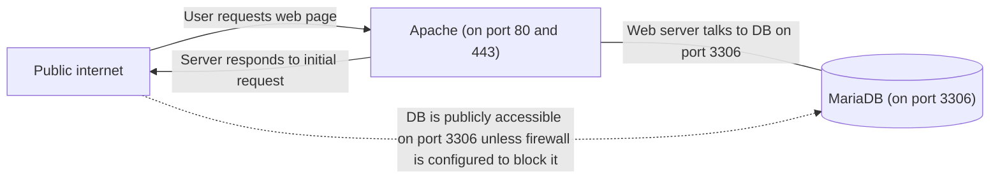
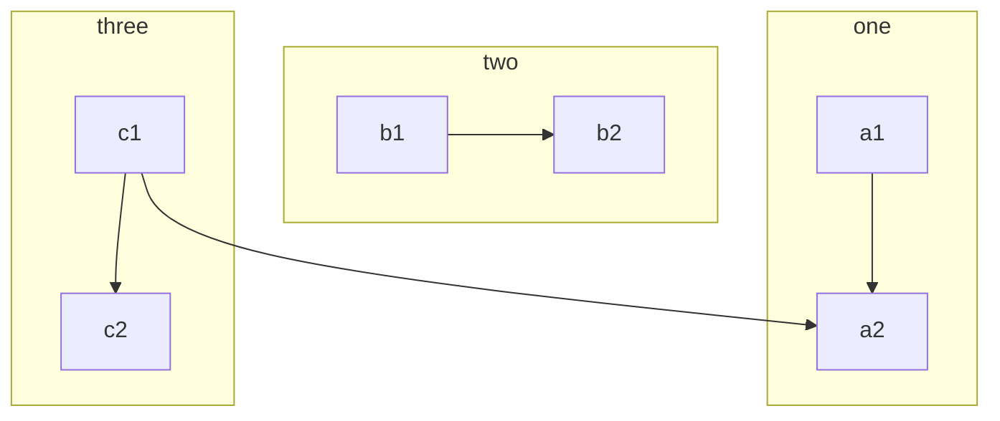
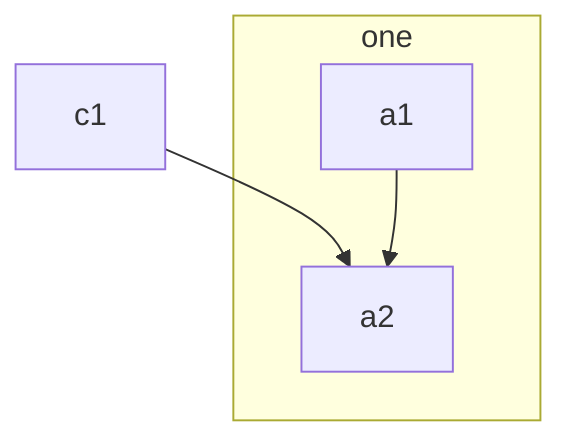

## The hard way

Okay, hopefully this section makes you feel better about your own practices, just remember we all start somewhere... 😅

#### Running locally

The first web app I built was a social network back in 2015, written in PHP with a MariaDB database and hosted from my school laptop so my friends could access it over the local network.

At this point in time I knew nothing about running web servers or databases, I just started a magical program called [XAMPP](https://www.apachefriends.org/) and everything ran for me. 🤷🏽‍♂️

#### Running on a live server

I eventually moved it to an Ubuntu VPS where I needed to install a full AMP (Apache, MariaDB, PHP) stack myself, and quickly realised that sometimes code that worked locally **didn't work on the server**, but better yet, a simple `sudo apt update && sudo apt upgrade` would sometimes just **suddenly break my app** since it updated the dependencies installed natively on the system.

Given how difficult it was to keep the code working locally and live, I ended up ditching my local environment and just developing directly on the live server via SFTP, with **zero version control** and patching any breakages that happened when I ran a system update. Feeling better about your own practices yet? 🤦🏽‍♂️

#### Running multiple web apps

When the time came to serve more websites, I found [Apache virtual hosts](https://httpd.apache.org/docs/2.4/vhosts/) did the trick, but because they all used the same version of Apache (therefore, PHP) and MariaDB, a system update that introduced a breaking change would break all the websites at once!

#### Live server architecture diagram



## The easy way - Docker as a platform 🚢

Fast forward almost a decade and I've found a perfect balance for me that leverages containerisation without the complexity level of Kubernetes.

finally using Docker containers to solve the dependency problem, but . But running containers on AWS App Runner or Fargate is expensive, and if I suddenly get a lot of traffic for

K8S was overkill for me, but I could still lean into Docker as a deployment platform.





## Install Docker on your EC2 instance

Follow the [official installation instructions](https://docs.docker.com/engine/install/) on Docker's website.

## Portainer

Portainer is a nice way to get a visualisation and some GUI controls of a Docker environment on a server.

Follow the [official installation instructions](https://docs.portainer.io/start/install-ce/server/docker/linux) on Portainer's website.

One additional step we want to do is create a shared infrastructure Docker bridge network, so all services that need to communicate with the NGINX reverse proxy can. and add portainer to it. You can call this whatever you like, I will just call it `shared`.

```bash
# Create shared infrastructure network
docker network create shared

# Add Portainer container to the new shared network
docker network connect shared portainer
```

Thanks to Docker's [networking and DNS magic](https://docs.docker.com/network/#ip-address-and-hostname), containers can use other containers' names as their hostnames if they are in the same network! 🪄🙇🏽‍♂️

## Reverse Proxy and SSL

### High level intro

Now in order to actually reach our Portainer installation, we will need to configure a reverse proxy to direct web traffic to it. We will use NGINX as the reverse proxy, to listen for incoming web traffic, and direct it to the Portainer container if it's coming in on the subdomain we want to point to Portainer.

We want all web traffic to be encrypted with SSL, so we will use Certbot to provision SSL certificates from Let's Encrypt.

In order for Let's Encrypt to provision an SSL certificate, Certbot will listen on port 80 and we need a DNS record pointing to the server we're running Certbot on.

I created the `portainer` subdomain on `tobyscott.dev` for Portainer. You can read about how I use Terraform to manage my DNS records in Cloudflare here if you're interested.

### Installing Certbot and provisioning certificates

Once you have created a DNS "A" record for the domain or subdomain you are provisioning that points to the server running Certbot, log into the EC2 instance to install Certbot and obtain a certificate.

```sh
# Install Certbot
sudo apt install certbot

# Obtain a standalone certificate
sudo certbot certonly --standalone -d portainer.tobyscott.dev
# This will place the certificate and private key in the `/etc/letsencrypt/live/portainer.tobyscott.dev/` directory.
```

### NGINX config

Now let's write the config file for our NGINX reverse proxy, to listen for web traffic coming in on `portainer.tobyscott.dev` and do the following:

- If coming in on HTTP, redirect to HTTPS.
- If coming in on HTTPS, use SSL certificate, and direct it to the Portainer container.

The portainer container will be listening for HTTPS traffic on port `9443`, and since the NGINX reverse proxy will be in the same Docker network as the Portainer container, we can use the container name as the host name and let Docker's DNS work it's magic. 🪄

Create an `nginx.conf` file with the following contents:

```nginx
# Portainer

server {
	listen 80;
	server_name portainer.tobyscott.dev;
	return 301 https://$host$request_uri;
}

server {
	listen 443 ssl;
	server_name portainer.tobyscott.dev;
	ssl_certificate /etc/nginx/ssl/live/portainer.tobyscott.dev/fullchain.pem;
	ssl_certificate_key /etc/nginx/ssl/live/portainer.tobyscott.dev/privkey.pem;
	location / {
		proxy_pass https://portainer:9443;
		proxy_set_header Host $host;
		proxy_set_header X-Real-IP $remote_addr;
		proxy_set_header X-Forwarded-For $proxy_add_x_forwarded_for;
		proxy_set_header X-Forwarded-Proto $scheme;
	}
}
```

> You'll want to add this `nginx.conf` file to a git repo and set up a deployment pipeline that copies the config to the EC2 and restarts NGINX so you can add/remove domains and services by committing to git. (Except we'll still have to log into the server to manually obtain a certificate for any new domains)
>
> You could also consider creating a `Dockerfile` and bake this config into a custom NGINX image, but I'm going to just map a volume so the container uses the config stored on the EC2.

### Running the NGINX container

Now let's start the NGINX container, mapping the ports and bind-mounting the NGINX configuration directory and the Let's Encrypt directory to the appropriate locations inside the container.

```sh
# REVISED. ACTUALLY USED ON TOBYSCOTT.DEV EC2 INSTANCE
docker run --name nginx-proxy -d \
    -v /home/ubuntu/nginx/config:/etc/nginx/conf.d:ro \
    -v /etc/letsencrypt:/etc/nginx/ssl:ro \
    --network shared \
    -p 80:80 -p 443:443 \
    nginx:1.25.2


# ORIGINAL - DO NOT USE IN TUTORIAL. JUST KEEPING INCASE I MISSED SOMETHING
docker run --name nginx-proxy -d \
    -v /home/ubuntu/nginx/config:/etc/nginx/conf.d:ro \
    -v /home/ubuntu/nginx/auth/.htpasswd:/etc/nginx/auth/.htpasswd \
    -v /etc/letsencrypt:/etc/nginx/ssl:ro \
    -v /home/ubuntu/nginx/entry.sh:/entry.sh \
    --entrypoint /entry.sh \
    --network="host" \
    nginx:1.25.2
```

Now the NGINX container is running, we should be able to reach Portainer from `https://portainer.tobyscott.dev`. Visit that and you should see the initial Portainer setup. Please follow the prompts to create your initial admin account.

### Automatic SSL certificate renewal with a Cronjob

Let's Encrypt certificates are valid for 90 days. You'll want to set up a cron job or systemd timer to automatically renew the certificates. After renewal, you'll also need to restart the NGINX container to pick up the new certificate. ** research: do we actually need to restart nginx?? **

```sh
sudo crontab -e
```

Add the following line to routinely attempt to renew the certificate (daily at 2 AM). If the certificate is close to expiration, it will be renewed, and the NGINX container will be restarted.

```
0 2 * * * /usr/bin/certbot renew --quiet && docker restart nginx
```

Note, if you ever need to manually renew the certificates, you can do so like this:

```bash
# Stop the reverse proxy that's running on port 80 as Certbot requires that port to be open for certificate renewal
docker stop nginx

# Ask Certbot to renew the certificates, wait until this finishes.
sudo certbot renew

# Restart the nginx-proxy now port 80 isn't required anymore.
docker start nginx
```

** research: hold up, wouldn't nginx need to be stopped IN THE CRONJOB TOO while it renews the certificate so port 80 is available if it needs to provision a new one? **

## Running your own apps!

Now the fun part, let's get your own containerised apps running on the EC2 instance and accessible via the reverse proxy!

I have an app I want to pull from a private ECR repository, so I'll install the AWS CLI on the EC2 instance and authenticate with credentials authorised to pull images from the private repository.

```bash
# Install AWS CLI tool
sudo apt install awscli

# Configure AWS CLI with my AWS Access Key ID and Secret Access Key
aws configure

# Authenticate Docker so it can pull images from the private ECR repository
aws ecr get-login-password --region us-east-1 | docker login --username AWS --password-stdin <aws-account-id>.dkr.ecr.us-east-1.amazonaws.com
```

Now let's run the `latest` tag of `myawesomeapp` in a container in the `shared` network!

```bash
docker run --name myawesomeapp --network shared -d <aws-account-id>.dkr.ecr.us-east-1.amazonaws.com/myawesomeapp:latest
```

Wow, that was easy. Now we need to request an SSL certificate for this new domain.

The first step is to create a "A" record that points to the server's IP address.

Once you've done that, let's stop NGINX so Certbot can bind to port 80 and request the certificate.

```bash
# Stop NGINX so Certbot can bind to port 80
docker stop nginx

# Request a new cerificate be provisioned by Let's Encrypt
sudo certbot certonly --standalone -d myawesomeapp.com
```

Now before restarting the NGINX container, let's update the config. I know this app runs on port `8080`, so I'll add the following lines to the `nginx.conf` file to direct traffic coming in from `myawesomeapp.com` to HTTP port `8080` of the `myawesomeapp` container.

> Note this domain is completely different from `tobyscott.dev`. This is absolutely possible, and a great feature of this architectural design.

```nginx
# My Awesome App

server {
	listen 80;
	server_name myawesomeapp.com;
	return 301 https://$host$request_uri;
}

server {
	listen 443 ssl;
	server_name myawesomeapp.com;
	ssl_certificate /etc/nginx/ssl/live/myawesomeapp.com/fullchain.pem;
	ssl_certificate_key /etc/nginx/ssl/live/myawesomeapp.com/privkey.pem;
	location / {
		proxy_pass http://myawesomeapp:9443;
		proxy_set_header Host $host;
		proxy_set_header X-Real-IP $remote_addr;
		proxy_set_header X-Forwarded-For $proxy_add_x_forwarded_for;
		proxy_set_header X-Forwarded-Proto $scheme;
	}
}
```

Now everything's in place, let's start the NGINX container up again and see what happens!

```bash
# Restart the NGINX container to reload NGINX.
docker start nginx

# You can also reload NGINX without restarting the container, but it may be easier to just restart the container.
docker exec -it <container_name> nginx -s reload
```

---

AS FAR AS I GOT

---

## Database

### Running the container with Docker

When we run the PostgreSQL container, we'll bind a volume to the container at the directory the data is stored at. This will

```sh
docker run --name postgres \
	-e POSTGRES_PASSWORD=mysecretpassword \
	-v /data/postgres:/var/lib/postgresql/data \
	-p 5432:5432 \
	-d postgres:15.4
```

Run latest beacon-api container

```bash
docker run --name beacon-api \
	-p 3000:8080 \
	--env-file beacon-api.env \
    -d <aws-account-id>.dkr.ecr.us-east-1.amazonaws.com/safety-beacon-api:latest
```
