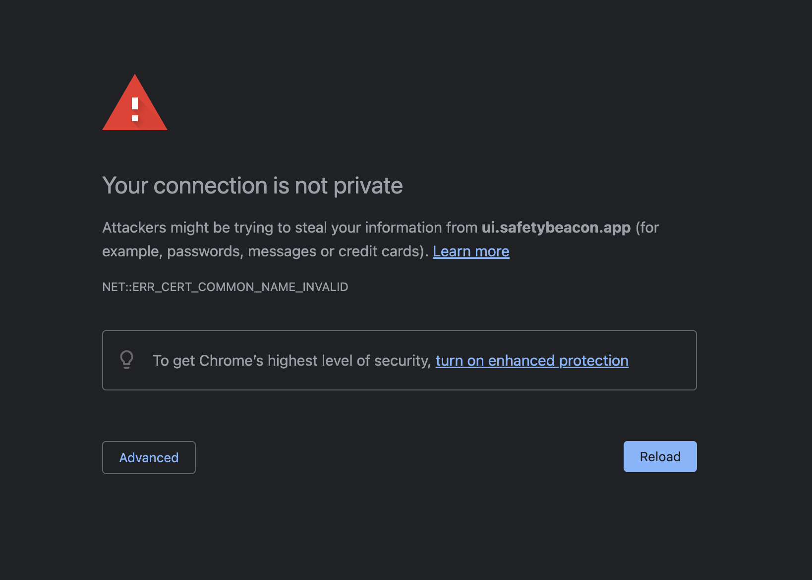

### Introduction

Hosting a static website on AWS provides a scalable and cost-effective solution with high availability. In this guide, we'll walk through the entire process, from setting up an S3 bucket to configuring CloudFront for CDN and HTTPS with a custom domain, and finally, integrating a CICD pipeline using GitHub Actions.

### Step 1: Create an S3 Bucket

Navigate to the S3 service in the AWS Management Console and click on "Create bucket" and enter a unique bucket name (all S3 buckets across all accounts must have a unique name, so you may need to try a few names before you find one that's not taken).

Unblock all public access settings for this bucket. Note, as you are hosting a static site, all assets stored in the bucket will be publicly available. DO NOT store any sensitive information in the bucket. Leave all unmentioned settings as their default and click "Create bucket" to provision the bucket! Next we will need to configure it for static website hosting.

Go to the "Properties" tab of your bucket, scroll down to "Static website hosting", enable static website hosting and select "Host a static website". Pretty straight forward so far, right? Enter the index document name (e.g. `index.html`) and, optionally, an error document, and save your changes.

> If you are deploying a SPA with client-side routing, you will want to enter `index.html` for both the index page and error page. If all pages are separate HTML files and there is no client-side routing that happens in the browser, you may want to specify `error.html` or similar as the error page to be served if the requested page is not found.

Now we need to set a bucket policy for public access. Go to the "Permissions" tab and click on "Bucket Policy" and add a policy to make the bucket content publicly accessible. Use the following policy, replacing `your-bucket-name` with your actual bucket name:

```json
{
  "Version": "2012-10-17",
  "Statement": [
    {
      "Effect": "Allow",
      "Principal": "*",
      "Action": "s3:GetObject",
      "Resource": "arn:aws:s3:::your-bucket-name/*"
    }
  ]
}
```

Now create an `index.html` file with the following contents and upload it to your bucket.

```html
<html>
  <head>
    <title>Static hosting demo</title>
  </head>
  <body>
    <h1>It works!</h1>
  </body>
</html>
```

Now if you go to the Properties tab and scroll down to the Static Website Hosting section, you will see a URL that looks something like this: `http://your-bucket-name.s3-website-region.amazonaws.com`

Visit it and you should see your uploaded `index.html` page rendered in the browser! Congrats, you now have a statically hosted website, but there are two things yet to address, it's currently served over HTTP (not HTTPS) and the domain is a little ugly (sorry Amazon), we want a "Mirror, mirror on the wall, who is the prettiest domain of them all?" kind of domain! For that we'll need something a little smarter than a static file storage bucket, such as a Load Balancer, but AWS makes this really easy (and cheap!) for us with their CloudFront CDN that supports this perfectly while hiding all that load-balancer magic from us!

### Step 2: Create a CloudFront Distribution

Navigate to the CloudFront service in the AWS Management Console, click "Create Distribution" and choose your new S3 bucket as the origin. You should see a message letting you know the bucket has static web hosting enabled and prompting you to use the website endpoint rather than the bucket. That's what you want!

Choose HTTP only on port 80, as the bucket's website endpoint is only available over HTTP, not HTTPS. Note, internally in AWS, CloudFront will read from the bucket over HTTP, but the connection between your users and CloudFront will still be over HTTPS!

Scroll down to 'Default cache behaviour' and set the 'Viewer protocol policy' to 'Redirect HTTP to HTTPS' to ensure all user traffic is secure. This is one of those magic things that usually requires a load balancer that AWS includes as a feature of their CDN.

Enabling WAF is entirely up to you, it doesn't matter either way for the sake of this tutorial. It costs a little extra every month, but is useful if you want the extra protection against DOS attacks that will rack up a huge cloud bill. Please do your reading on this one if you are running a production website.

Under the 'Settings' section we can configure some more of the magic that uses a global load balancer under the hood to configure a custom domain and SSL certificates, but let's come back to that later. Create your distribution now! You'll need to wait a couple minutes for your CloudFront distribution to be provisioned. Sit tight!

Keep note of the AWS region you're provisioning your CloudFront distribution in, we will need that in the next step!

When it is done you should see your distribution's domain name under the "Details" section that looks something like `distribution-id.cloudfront.net`. Visit that and you will see the HTML page stored in your static bucket again, but over HTTPS this time! This indicates that your connection is secure and encrypted with an SSL certificate. But the domain is still a little ugly isn't it... If we point a custom domain straight to this CDN distribution we will get an SSL error because the SSL certificate used only supports your generated CloudFront distribution domain, this is what prevents anyone from pointing custom domains to any website. Let's get do that next.

### Step 3: Create a managed SSL Certificate

Navigate to the Certificate Manager service in the AWS Management Console and make sure you have the same region selected as you did when creating the CloudFront distribution. The SSL certificate MUST be provisioned in the same AWS region as the CloudFront distribution that uses it. Once you have confirmed that, click "Request a certificate" and choose "Request a public certificate".

As we mentioned before, the SSL certificate must know all domains that will be used to visit the website, so you will need to enter the (sub)domain(s) you want to point to this static site. Note, you can add more than one!

For the sake of this tutorial, leave the validation method as DNS validation, and click "Request". You will see the status is "Pending verification". Scroll down to the "Domains" section and you will see the DNS record(s) you need to create to verify that you own the domain. Add the required verification DNS record to your domain and wait for AWS to detect it and verify your SSL certificate. This can take a while, so be patient. Once it is successfully verified, you'll see the status of the SSL certificate will have changed from "Pending verification" to "Issued".

### Step 4: Create DNS record(s) that point to the CloudFront Distribution

Now we've created the verification DNS record and the certificate has been issued, but we are still yet to create the actual DNS record that points web traffic to our static site served by CloudFront. You can create these at the same time, I just separated these steps for the sake of this tutorial.

You will want to create a CNAME record that points your custom domain to the CloudFront distribution's domain. For example:

| Record type | Record name | Record value                     |
| ----------- | ----------- | -------------------------------- |
| CNAME       | `www`       | `distribution-id.cloudfront.net` |

You can create as many DNS records to point to your CloudFront distribution as you would like, but they will all have to be added to your managed SSL certificate or you will get an SSL error when visiting the website from the domain that's not supported by the certificate!

It's worth noting, you cannot create a CNAME record at your domain's apex (eg. `your-domain.com`), only subdomains, so you can either create a `www` subdomain like in the example above and have a redirect configured on your domain apex to redirect to the `www` subdomain, or you can use a DNS provider that supports CNAME flattening such as [CloudFlare](https://developers.cloudflare.com/dns/cname-flattening/) to resolve the domain apex to the IP address of the CNAME record value.

Depending on the DNS server your computer talks to, your new domain may start resolving immediately or it may not, be prepared to allow up to 24 hours for your new DNS records to propagate to the DNS server you're using. If you need you, you can always override your local DNS resolution via the `/etc/hosts` file.

Okay, let's now let's visit our static website from our brand new shiny domain! WAIT... Uh oh! We get an SSL certificate error! That's right, remember earlier when I mentioned the load balancer needs to use the certificate that knows about our custom domain? That's exactly why we're seeing this error, and this is a good thing! It means people can't just point any domain they like to your website!



As I also mentioned before, Amazon hide's all the load-balancing complexity under the hood of their CloudFlare CDN, so let's tell CloudFlare to use our managed SSL certificate.

### Step 5: Adding the managed SSL Certificate to the CloudFront Distribution

Navigate to the CloudFront service in the AWS Management Console, choose the distribution for your static website and edit the 'Settings' section under the 'General' tab.

Add all domain name(s) you created that point to this CloudFront distribution under the 'Alternate domain name (CNAME)' section, choose your new managed SSL certificate that knows about the authorised domains in the 'Custom SSL certificate' section and save the changes. You will need to wait a minute or two for your changes to be propagated across the CDN network.

Now visit your custom domain and you should see the "It works" webpage served over HTTPS! Ahh... Mirror, mirror, on the wall, who is the prettiest domain of them all?

### Step 6: Setting up CICD pipeline with GitHub actions

Now this step is going to be a little dependant on how you build your static site, whether it's a fully generated static site or a SPA.

For the sake of this tutorial, I will be building and deploying a ReactJS app that requires a build step before deploying the statically generated assets to the S3 bucket. If your website is pure HTML, CSS and JavaScript that is ready to be interpreted by the browser, you will not need a build step.

In my GitHub repo, I'm creating an action workflow file named `.github/workflows/deploy.yaml` with the following contents:

```yaml
name: Build and deploy

on:
  push:
    branches:
      - main
  workflow_dispatch: # Allows the action to be run manually from GitHub UI

jobs:
  build-and-deploy:
    name: Build and deploy
    runs-on: ubuntu-22.04

    env:
      AWS_REGION: us-east-1

    steps:
      - uses: actions/checkout@v4

      - name: Install dependencies
        run: npm install

      - name: Build the React app
        run: npm run build

      - name: Configure AWS credentials
        uses: aws-actions/configure-aws-credentials@v1
        with:
          aws-region: ${{ env.AWS_REGION }}
          aws-access-key-id: ${{ secrets.AWS_ACCESS_KEY_ID }}
          aws-secret-access-key: ${{ secrets.AWS_SECRET_ACCESS_KEY }}

      - name: Upload site artifacts to S3
        run: aws s3 sync . s3://${{ secrets.S3_BUCKET_NAME }}/ --delete
        working-directory: dist

      - name: Invalidate CloudFront distribution cache
        run: aws cloudfront create-invalidation --distribution-id ${{ secrets.CLOUDFRONT_DISTRIBUTION_ID }} --paths "/*"
```

You can see from a high level it does the following on every commit to the `main` branch:

- Checks out the repo code.
- Installs NPM dependencies required for the React app.
- Builds the React app (SPA) to static assets that can be hosted from a bucket.
- Authenticates to AWS in the specified region.
- Uploads the built React app assets (in the `dist` directory) to the S3 bucket.
- Invalidate's the CDN cache so the new S3 bucket contents are reflected immediately.

This all runs in the cloud on runners hosted by GitHub and we don't want to expose any sensitive information in this workflow file because it's stored as code in the repo. But GitHub still needs to know the secret values when running the workflow, so we will need to tell GitHub the values of the secrets.

Looking at the workflow file, the secrets are as follows:

- `AWS_ACCESS_KEY_ID` - Must be generated via Security Credentials page.
- `AWS_SECRET_ACCESS_KEY` - Must be generated via Security Credentials page.
- `S3_BUCKET_NAME` - The unique name of the bucket that holds the static assets.
- `CLOUDFRONT_DISTRIBUTION_ID` - Can be found in the CloudFront service section.

Add these required secrets to your GitHub repo under "Settings" -> "Secrets and variables" -> "Actions", then push a commit to the main branch and watch your app build and deploy!
