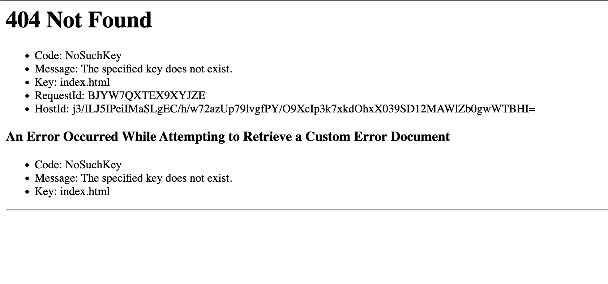
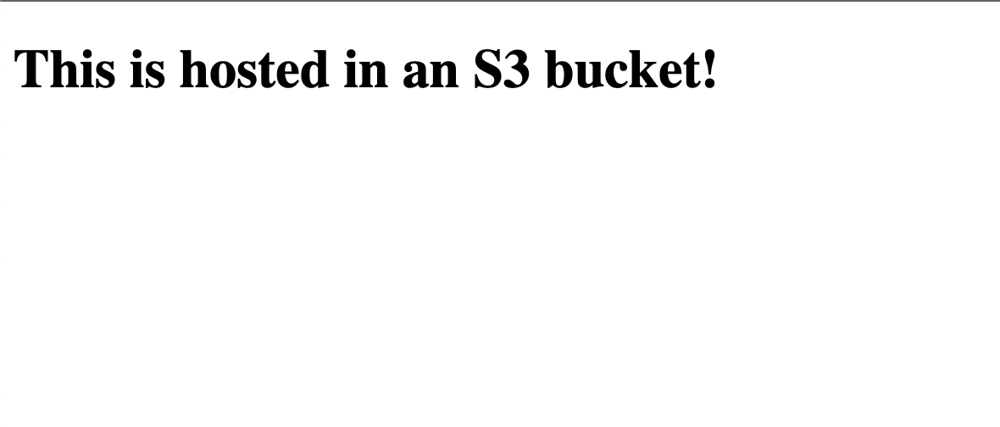
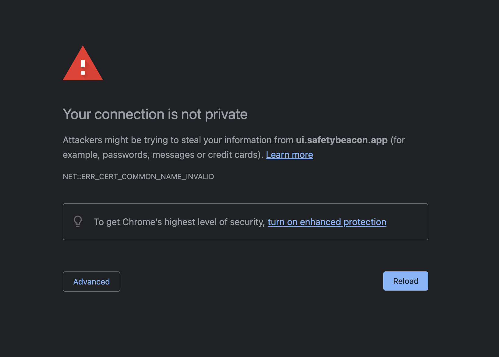

Choose a region (for me us-east-1 because it's cheap)

Create a bucket. Good idea to name it after the domain that will point to it.

Unblock all public access (and tick the box to acknowledge the warning).

Choose bucket, go to Properties, enable Static website hosting.

To make the objects in your bucket publicly readable, you must write a bucket policy that grants everyone `s3:GetObject` permission. When you grant public read access, anyone on the internet can access your bucket.

Go to Permissions

Edit the bucket policy, add this code (replace "Bucket-Name" with the name of your bucket):

```
{
	"Version": "2012-10-17",
	"Statement": [
		{
			"Sid": "PublicReadGetObject",
			"Effect": "Allow",
			"Principal": "*",
			"Action": [
				"s3:GetObject"
			],
			"Resource": [
				"arn:aws:s3:::Bucket-Name/*"
			]
		}
	]
}
```

Now if you visit the static website domain provided by AWS that's formatted like `http://your-bucket-name.s3-website-region.amazonaws.com` you will get a 404 page because you haven't uploaded an `index.html` file yet.



Create a file locally named `index.html` with the following contents (or different if you'd like):

```html
<!DOCTYPE html>
<html lang="en">
  <head>
    <meta charset="UTF-8" />
    <title>Example</title>
  </head>
  <body>
    <h1>This is hosted in an S3 bucket!</h1>
  </body>
</html>
```

Now go to "Objects", click "Upload", choose "Add files", and upload your `index.html` page. If you visit it again you will now see your `index.html` page!



You also may notice the protocol is `http` not `https`. To get `https` we will need to use AWS's global CDN solution, CloudFront.

Create a distribution.

Choose the bucket you created as the origin. You will be prompted to use the website endpoint since the S3 bucket has static web hosting enabled. Use the website endpoint.

Choose "HTTP only" as the protocol. This is isn't what the user will use to visit your site, this is what CloudFront will use to connect to the origin.

Under "Default cache behaviour" > "Viewer", select "Redirect HTTP to HTTPS". We don't want people browsing the website over HTTP, we want to redirect them to HTTPS so they are browsing over an encrypted connection.

Using Web Application Firewall (WAF) is your choice. It can be helpful but will incur additional costs. [More info](https://aws.amazon.com/waf/)

Create the distribution. Once that's deployed visit the distribution domain name (formatted as random-string.cloudfront.net).

You'll see the same custom index page as before, but you'll notice that it redirected you to HTTPS this time!

Let's set up your custom domain!

Create a CNAME record for your website, I suggest using `www.`, that points to your CloudFront distribution domain.

Now go to visit the new CNAME domain you created.

Uh oh! You will get a big scary privacy warning.



So what's going on and how do we fix it?

This is what prevents anyone just pointing their domain to your website or backend service. The SSL certificate doesn't match the new domain. So we need to update the SSL certificate (which only the web admin can do).

In our case, the SSL certificate is tied to the CloudFront distribution, which is why we can only get HTTPS when visiting the CloudFront distribution domain, not the S3 bucket domain.

Since our CNAME record points to the CloudFront distribution domain, when you visit it via the CNAME record, the browser throws this error because the SSL certificate for CloudFront doesn't match your custom domain.

Let's fix that!

Go to AWS Certificate Manager and request a new public certificate. For the Fully Qualified Domain Name, enter your domain name. You can also add multiple domain names to a single SSL certificate by clicking "Add another name to this certificate", and you can even add a wildcard domain `*.example.com` if you want to be able to protect any subdomain with this certificate.

Choose DNS validation and RSA 2048 as the key algorithm, finally click Request.

You'll see that the domain(s) are "pending validation", at this stage you need to prove that you own the domain by adding DNS records that AWS uses to "validate" that you own the domain. Create the CNAME record with the value next to the domain in the list of domains on the certificate.

Now is a waiting game, you will need to wait for the DNS records to propagate, for AWS to confirm that you own the domain, then for the CA (Certificate Authority) to provision this certificate before you can use it. Reload the page every now and again until you see the status for each domain is "Success" and the status of the certificate is "Issued".

Once that's ready, we need to tell the CloudFront distribution to use this SSL certificate for connections coming from specific domains.

Go to the CloudFront distribution, choose the General tab, and edit Settings.

Add an "alternate domain name (CNAME)" (this cannot be a wildcard), then choose the SSL certificate we requested before as the custom SSL certificate and save the changes.

The CloudFront distribution will be redeployed, once that's done, visit it again via your custom domain name.

Congratulations, you've deployed a static site to S3 that you're serving over HTTPS with a custom domain!
